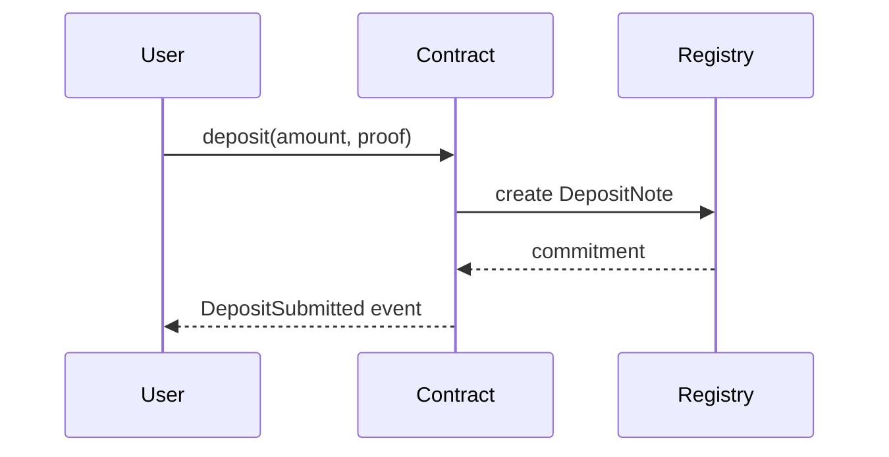

# Noir Contract Specification Workbook: Noir Math Refactor

**Contract Path**: `src/lib.nr`
**Spec YAML**: `.claude/spec/001-noir-math-refactor/math.aztec-spec.yaml`
**Tree File (generated later)**: `tests/specs/math.tree`
**Created**: 2025-09-25
**Status**: Draft
**Input Context**: "noir-math-refactor"

> 🗂️ **Reference**: Follow the [Aztec/Noir Contract Meta-Language](.claude/docs/aztec-contract-meta-language.md) when filling out this workbook. The YAML section below is the authoritative source for downstream tooling.

## Execution Flow (main)
```
1. Validate Input Context exists
   → If empty: ERROR "Missing Noir feature description"
2. Establish contract scope (modules, functions, privacy domain)
3. Capture documentation & motivations
4. Construct YAML spec using the meta-language schema
5. Detail behavioral flows and visibility transitions
6. Provide sequence diagram references or inline definitions
7. Derive initial BTT branches from YAML + flows
8. Populate test guidance & coverage expectations
9. Run Review Checklist
   → If clarifications remain: WARN "Spec requires answers before generation"
10. Return: SUCCESS when mandatory sections satisfied
```

---

## 🧭 Collaboration Notes *(optional)*
- Discussion highlights: [key agreements or open debates]
- Stakeholders: [names / handles]
- Pending clarifications: [NEEDS CLARIFICATION: question]

---

## 📄 Contract Documentation *(mandatory)*

### Summary & Motivation
- **Summary**: A comprehensive fixed-point arithmetic library for Noir/Aztec, providing safe mathematical operations across multiple precision levels (WAD, RAY, RAD) for use in DeFi applications, specifically a stablecoin implementation.
- **Motivation**: Essential foundation for implementing MakerDAO-style stablecoin logic in Aztec, ensuring precise financial calculations with overflow protection and consistent decimal handling across the protocol.
- **Rationale**: Ported from proven Solidity implementation to maintain compatibility with existing DeFi patterns while adapting to Noir's type system and constraints. Prioritizes safety and precision over gas optimization.

### References
- [Bei Stable Coin Math.sol](https://github.com/t4sk/bei-stable-coin/blob/main/src/lib/Math.sol) — Original Solidity implementation with human-readable naming
- [MakerDAO DSMath](https://github.com/makerdao/dss) — Original inspiration for fixed-point arithmetic patterns

### Security Considerations
- **Integer Overflow/Underflow**: All arithmetic operations must check for overflow/underflow conditions before executing
- **Precision Loss**: Operations between different precision levels (WAD/RAY/RAD) must handle rounding consistently
- **Signed/Unsigned Conversions**: Mixed-type operations require careful bounds checking to prevent wraparound
- **Division by Zero**: All division operations must validate non-zero denominators

### Audit History / Notes *(optional)*
- [Link or TODO]

---

## 🧾 YAML Specification *(mandatory)
Fill using the meta-language schema. Remove unused sections to keep the spec concise.

```yaml
version: 0.1
metadata:
  id: noir-math-lib-v1
  created: 2025-09-25
  owners: [the-final-boss]
contract:
  name: Math
  type: library
  path: src/lib.nr
  description: Fixed-point arithmetic library for DeFi operations
constants:
  - name: WAD
    value: 10^18
    description: Standard decimal precision (18 decimals)
  - name: RAY
    value: 10^27
    description: Higher precision for rate calculations (27 decimals)
  - name: RAD
    value: 10^45
    description: Highest precision for accumulated values (45 decimals)
  - name: I64_MAX
    value: 9223372036854775807
    description: Maximum signed 64-bit integer
  - name: I64_MIN
    value: -9223372036854775808
    description: Minimum signed 64-bit integer
functions:
  # Currently Implemented
  - name: add
    signature: "fn add(x: u128, y: i64) -> u128"
    description: Safe addition with mixed sign types
    test_guidance: Test overflow, underflow, zero, and boundary values
  - name: sub
    signature: "fn sub(x: u128, y: i64) -> u128"
    description: Safe subtraction with mixed sign types
    test_guidance: Test underflow, overflow with negative y, boundaries
  - name: mul
    signature: "fn mul(x: u128, y: i64) -> i64"
    description: Safe multiplication with overflow protection
    test_guidance: Test I64_MIN edge case, zero multiplication, overflow scenarios

  # To Be Implemented
  - name: min
    signature: "fn min(x: u128, y: u128) -> u128"
    description: Return minimum of two values
    test_guidance: Test equal values, x < y, x > y
  - name: max
    signature: "fn max(x: u128, y: u128) -> u128"
    description: Return maximum of two values
    test_guidance: Test equal values, x < y, x > y
  - name: diff
    signature: "fn diff(x: u128, y: u128) -> i64"
    description: Calculate signed difference between unsigned integers
    test_guidance: Test when result exceeds I64_MAX, negative results
  - name: to_rad
    signature: "fn to_rad(wad: u128) -> Field"
    description: Convert WAD precision to RAD precision
    test_guidance: Test precision preservation, large values
  - name: wmul
    signature: "fn wmul(x: u128, y: u128) -> u128"
    description: Multiply with WAD precision
    test_guidance: Test rounding, overflow, precision loss
  - name: wdiv
    signature: "fn wdiv(x: u128, y: u128) -> u128"
    description: Divide with WAD precision
    test_guidance: Test division by zero, rounding, precision
  - name: rmul
    signature: "fn rmul(x: u128, y: u128) -> u128"
    description: Multiply with RAY precision
    test_guidance: Test rounding, overflow, precision loss
  - name: rdiv
    signature: "fn rdiv(x: u128, y: u128) -> u128"
    description: Divide with RAY precision
    test_guidance: Test division by zero, rounding, precision
  - name: rpow
    signature: "fn rpow(x: u128, n: u128, base: u128) -> u128"
    description: Exponentiation with custom base and overflow protection
    test_guidance: Test edge cases n=0, n=1, large exponents, overflow
invariants:
  - "add(x, y) reverts on overflow when y > 0 and x + y > U128_MAX"
  - "sub(x, y) reverts on underflow when y > 0 and x < y"
  - "mul(x, y) reverts when result would exceed I64_MAX or I64_MIN"
  - "wdiv and rdiv revert on division by zero"
  - "Precision operations maintain accuracy within rounding tolerances"
```

> ✅ Work iteratively with the user. you can ask for missing data wherever `[NEEDS CLARIFICATION: ...]` markers are inserted. always explain what your about to do and then ask the user to sign off before moving on

---

## 🔄 Behavioral Flows *(mandatory)*
Capture key computational patterns for DeFi operations.

### Flow Exhaustive List
| Flow | Description | Functions Used | Computational Pattern | Notes |
| --- | --- | --- | --- | --- |
| InterestAccumulation | Calculate accumulated interest on debt | `rmul`, `rpow` | rate * principal * time^n | RAY precision for rates |
| CollateralRatio | Compute collateral/debt ratio | `wdiv`, `wmul` | (collateral * price) / debt | WAD precision for ratios |
| FeeCalculation | Apply percentage-based fees | `wmul`, `add` | amount * fee_rate | Fees in WAD precision |
| PrecisionConversion | Convert between precision levels | `to_rad`, `wmul`, `wdiv` | WAD → RAY → RAD | Maintain accuracy |
| SafeArithmetic | Bounded arithmetic operations | `add`, `sub`, `mul` | Check overflow/underflow | Mixed signed/unsigned |

### Narrative Walkthroughs
1. **Name**: InterestAccumulation
   - **Trigger**: Time-based rate accumulation in lending protocol
   - **Steps**:
     - Calculate time delta since last update
     - Use `rpow` to compute compound interest factor
     - Apply rate with `rmul` to principal amount
     - Handle precision with RAY constants
   - **Key Invariants**: No overflow on large principals, maintain 27-decimal precision

2. **Name**: CollateralRatio
   - **Trigger**: Liquidation check or loan origination
   - **Steps**:
     - Fetch collateral amount and current price
     - Multiply using `wmul` for collateral value
     - Divide by debt using `wdiv` for ratio
     - Compare against liquidation threshold
   - **Key Invariants**: Division by zero protection, ratio accuracy to 18 decimals

3. **Name**: SafeArithmetic
   - **Trigger**: Any mixed-sign arithmetic operation
   - **Steps**:
     - Check sign of i64 parameter
     - Convert to appropriate unsigned type if needed
     - Perform bounds checking before operation
     - Execute arithmetic with overflow protection
   - **Key Invariants**: No silent overflow, proper handling of I64_MIN edge case

---

## 📈 Sequence Diagrams *(optional but recommended)
Provide inline Mermaid diagrams or links to external assets.



- [Diagram ID](./diagrams/deposit_flow.png) — [Short description]

---

## 🌳 BTT Seed Draft *(mandatory once YAML is stable)
Outline initial Branching Tree Technique branches derived from the YAML spec. This draft will later feed `/noir-treegen`.

```tree
Math Library
├── add(x: u128, y: i64)
│   ├── When y is positive
│   │   ├── It should return x + y when no overflow
│   │   └── It should revert when x + y > U128_MAX
│   ├── When y is negative
│   │   ├── It should return x - |y| when x >= |y|
│   │   └── It should revert when x < |y|
│   └── When y is zero
│       └── It should return x unchanged
├── sub(x: u128, y: i64)
│   ├── When y is positive
│   │   ├── It should return x - y when x >= y
│   │   └── It should revert when x < y
│   ├── When y is negative
│   │   ├── It should return x + |y| when no overflow
│   │   └── It should revert when x + |y| > U128_MAX
│   └── When y is zero
│       └── It should return x unchanged
├── mul(x: u128, y: i64)
│   ├── When y is zero
│   │   └── It should return 0
│   ├── When x > I64_MAX
│   │   └── It should revert with "x > max int128"
│   ├── When y is I64_MIN
│   │   └── It should handle edge case correctly
│   ├── When y is positive
│   │   ├── It should return x * y when no overflow
│   │   └── It should revert when x * y > I64_MAX
│   └── When y is negative
│       ├── It should return -(x * |y|) when no overflow
│       └── It should revert when x * |y| > I64_MAX + 1
├── wmul(x: u128, y: u128)
│   ├── It should multiply with WAD precision
│   ├── It should round down by default
│   └── It should revert on overflow
├── wdiv(x: u128, y: u128)
│   ├── When y is zero
│   │   └── It should revert
│   ├── It should divide with WAD precision
│   └── It should round down by default
├── rpow(x: u128, n: u128, base: u128)
│   ├── When n is 0
│   │   └── It should return base (1 in given precision)
│   ├── When n is 1
│   │   └── It should return x
│   ├── When x is 0
│   │   └── It should return 0
│   └── When computing large powers
│       ├── It should maintain precision
│       └── It should revert on overflow
└── Invariant Tests
    ├── Overflow protection across all operations
    ├── Precision preservation in conversions
    └── Commutative property where applicable
```

> Align node titles with YAML `functions.test_guidance`, `flows.stages`, and `invariants` to keep transformations deterministic.

---

## 🧪 Test Planning *(mandatory)

### Coverage Matrix
| Test Type | Scenario | Expected Assertions | Tooling Notes |
| --- | --- | --- | --- |
| Unit | add/sub/mul basic operations | Correct arithmetic results | Pure function tests |
| Unit | Overflow detection | Reverts with proper error message | Test U128_MAX, I64_MIN/MAX boundaries |
| Unit | Sign handling in mixed types | Correct conversion and calculation | Focus on negative i64 values |
| Unit | Precision operations (wmul/wdiv/rmul/rdiv) | Maintains 18/27 decimal precision | Check rounding behavior |
| Fuzz | Random arithmetic inputs | No unexpected reverts, correct results | Constrain to valid ranges |
| Fuzz | Precision preservation | Output precision matches expected | Test with large/small values |
| Security | Division by zero | Always reverts | Test wdiv, rdiv with y=0 |
| Security | I64_MIN edge case | Proper handling without overflow | Special case in mul function |

### Targets
- **Happy Paths**: 100% coverage of normal operations
- **Negative Paths**: All revert conditions tested (overflow, underflow, div-by-zero)
- **Fuzz Horizon**: 10,000 iterations per function
- **Boundary Testing**: All MAX/MIN value combinations

### Outstanding Gaps
- None - all test scenarios defined

---

## ✅ Review & Acceptance Checklist

### Content Quality
- [x] Documentation filled with summary, motivation, and security notes
- [x] YAML spec validates against the meta-language schema
- [x] Open questions marked with `[NEEDS CLARIFICATION]` - None remaining
- [x] Roles and privacy domains explicitly stated - Library type, no roles needed

### Flow & Diagram Readiness
- [x] All critical flows captured - Computational flows documented
- [x] Sequence diagrams provided or linked for complex flows - Example provided

### Test & BTT Readiness
- [x] BTT seed aligns with YAML functions and invariants
- [x] Test matrix covers unit/integration/fuzz/security
- [x] Targets set for coverage and fuzzing

### Status Tracking
- [x] Input parsed
- [x] YAML drafted
- [x] Flows documented
- [x] Diagrams referenced
- [x] BTT seed prepared
- [x] Test planning completed
- [x] Checklist passed

---

## 📌 Appendix *(optional)*
- Additional context, data tables, or links supporting the spec
- Future enhancements or backlog items outside current scope