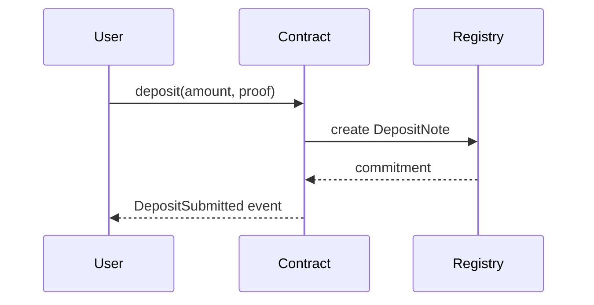

# Noir Contract Specification Workbook: [CONTRACT OR FEATURE]

**Contract Path**: `[src/contracts/.../*.nr]`  
**Spec YAML**: `[specs/.../*.aztec-spec.yaml]`  
**Tree File (generated later)**: `[tests/specs/.../*.tree]`  
**Created**: [DATE]  
**Status**: Draft  
**Input Context**: "$ARGUMENTS"

> 🗂️ **Reference**: Follow the [Aztec/Noir Contract Meta-Language](.claude/docs/aztec-contract-meta-language.md) when filling out this workbook. The YAML section below is the authoritative source for downstream tooling.

## Execution Flow (main)
```
1. Validate Input Context exists
   → If empty: ERROR "Missing Noir feature description"
2. Establish contract scope (modules, functions, privacy domain)
3. Capture documentation & motivations
4. Construct YAML spec using the meta-language schema
5. Detail behavioral flows and visibility transitions
6. Provide sequence diagram references or inline definitions
7. Derive initial BTT branches from YAML + flows
8. Populate test guidance & coverage expectations
9. Run Review Checklist
   → If clarifications remain: WARN "Spec requires answers before generation"
10. Return: SUCCESS when mandatory sections satisfied
```

---

## 🧭 Collaboration Notes *(optional)*
- Discussion highlights: [key agreements or open debates]
- Stakeholders: [names / handles]
- Pending clarifications: [NEEDS CLARIFICATION: question]

---

## 📄 Contract Documentation *(mandatory)*

### Summary & Motivation
- **Summary**: [Plain-language overview]
- **Motivation**: [Why this contract/library is needed]
- **Rationale**: [Design principles, trade-offs]

### References
- [Title](URL) — [Short note]
- [Title](URL) — [Short note]

### Security Considerations
- [Risk or assumption]
- [Mitigation or required assurance]

### Audit History / Notes *(optional)*
- [Link or TODO]

---

## 🧾 YAML Specification *(mandatory)
Fill using the meta-language schema. Remove unused sections to keep the spec concise.

```yaml
version: 0.1
metadata:
  id: [unique-id]
  created: [DATE]
  owners: [[teams or handles]]
contract:
  name: [ContractName]
  type: [contract|library|module|component]
  path: [src/contracts/...]
  aztec_kind: [public_contract|private_contract|hybrid|kernel_module]
  description: [one-liner]
roles:
  - name: [Role]
    description: [Responsibility]
state:
  public: []
  private: []
notes: []
events: []
functions: []
flows: []
invariants: []
external: {}
sequence_diagrams: []
btt_seed: {}
annotations: {}
```

> ✅ Work iteratively with the user. you can ask for missing data wherever `[NEEDS CLARIFICATION: ...]` markers are inserted. always explain what your about to do and then ask the user to sign off before moving on

---

## 🔄 Behavioral Flows *(mandatory)*
Capture key end-to-end journeys, especially privacy transitions.

### Flow Exhaustive List
| Flow | Description | Entry Function | Privacy Transition(s) | Notes |
| --- | --- | --- | --- | --- |
| DepositLifecycle | [user deposits assets] | `deposit` | public → private → public | [commitments, events] |
| [FlowName] | [summary] | [function(s)] | [transition sequence] | [important nuances] |

### Narrative Walkthroughs
1. **Name**: [Flow label]
   - **Trigger**: [caller, role, or state]
   - **Steps**: [ordered bullet list referencing functions]
   - **Artifacts**: [notes created/consumed, events emitted, nullifiers]

---

## 📈 Sequence Diagrams *(optional but recommended)
Provide inline Mermaid diagrams or links to external assets.



- [Diagram ID](./diagrams/deposit_flow.png) — [Short description]

---

## 🌳 BTT Seed Draft *(mandatory once YAML is stable)
Outline initial Branching Tree Technique branches derived from the YAML spec. This draft will later feed `/noir-treegen`.

```tree
[ContractOrContract::function]
├── When [condition from flows or invariants]
│   └── It should [action / outcome]
└── When [alternate condition]
    └── It should [failure or edge behavior]
```

> Align node titles with YAML `functions.test_guidance`, `flows.stages`, and `invariants` to keep transformations deterministic.

---

## 🧪 Test Planning *(mandatory)

### Coverage Matrix
| Test Type | Scenario | Expected Assertions | Tooling Notes |
| --- | --- | --- | --- |
| Unit | [Function behavior] | [State diff, return value] | [Requires mock note?] |
| Integration | [Cross-contract flow] | [Commitment emitted, event logged] | [Needs Aztec sandbox] |
| Fuzz | [Property/invariant] | [Invariant holds across randomized inputs] | [Value ranges] |
| Security | [Unauthorized attempt] | [Reverts, nullifier logged] | [Role expectations] |

### Targets
- **Happy Paths**: [count or %]
- **Negative Paths**: [count or %]
- **Fuzz Horizon**: [# iterations or time]

### Outstanding Gaps
- [NEEDS CLARIFICATION: e.g., fuzz parameter bounds]

---

## ✅ Review & Acceptance Checklist

### Content Quality
- [ ] Documentation filled with summary, motivation, and security notes
- [ ] YAML spec validates against the meta-language schema
- [ ] Open questions marked with `[NEEDS CLARIFICATION]`
- [ ] Roles and privacy domains explicitly stated

### Flow & Diagram Readiness
- [ ] All critical flows captured with privacy transitions
- [ ] Sequence diagrams provided or linked for complex flows

### Test & BTT Readiness
- [ ] BTT seed aligns with YAML functions and invariants
- [ ] Test matrix covers unit/integration/fuzz/security (remove rows if not applicable)
- [ ] Targets set for coverage and fuzzing

### Status Tracking
- [ ] Input parsed
- [ ] YAML drafted
- [ ] Flows documented
- [ ] Diagrams referenced
- [ ] BTT seed prepared
- [ ] Test planning completed
- [ ] Checklist passed

---

## 📌 Appendix *(optional)*
- Additional context, data tables, or links supporting the spec
- Future enhancements or backlog items outside current scope
